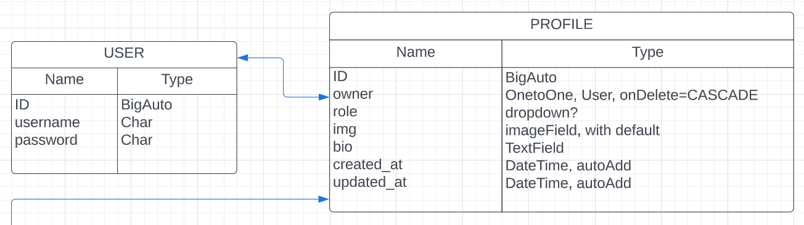

VELL MAGAZINE - BACKEND API
==================================

* * *

ABOUT THE API:
------------------

* * * 

[DEPLOYED API HEROKU LINK]()

[DEPLOYED FRONTEND HEROKU LINK - LIVE SITE]()

[DEPLOYED BACKEND GITHUB REPOSITORY]()

This is the Back End API for _Vell Magazine_, created using Django REST Framework. This back end, will return only JSON data.

So what do we need from our API?

From within the React app, we make HTTP requests to our drf api (which substituted the django context object with JSON responses).
JSON data, which React uses to then render the UI.
CRUD functionality! Create, Retrieve, Update or Delete things like a profile, a class, a booking, etc. This is through the HTTP requests.
Receive responses such as 2xx OK, 4xx ERROR, 5xx SERVER ERROR.

* * *

## DJANGO REST FRAMEWORK

* * *

I decided to use Django REST Framework as I can easily make use of its serializers, APIVIew & generics, permissions and authentications. It can serve both mobile and web apps.

Login and Log out views of our API in-browser interface. These come with our REST Framework.

* * * 

# PROFILE APP:

* * *

What functionality to we want?
* Authors have their own profile
* Authors can edit their profile: img, bio, socials.
* Authors can publish their own articles.
* Authors can edit their own profiles
* Other user can view other profiles
* Login/logout feature for our api in browser interface (django rest framework)

* * *

## MODEL:

We have made use of the standard Django user Model and referenced it in our models.

Profile Model Table:

ROLE HIERARCHY:
- Editor in chief
- Editor
- Author

USING DJANGO SIGNALS:
Every time a profile is created, a User is created. 

* * *

## VIEWS:

* * *

* ProfileList: 
    * get request listing all profiles.

* ProfileDetail
    * _get_object method_: View handling request made for profile that doesn't exist and checks permissions.
    * _get method_: View profile details by fetching using pk. Calls the get_object method, calls profile serializer, and returns serializer data.
    * _put method_: Calls _get_object_ method by pk, calls serializer with profile and update data. If serializer vaid, save profile instance to database and return data in our response. If invalid, return Response with error.(400_BAD_REQUEST)

* * *

## CUSTOM PERMISSIONS:

* * *

* Allow READ-ONLY access to every user
* Allow update and delete only to owner of resource.

* * *

* * *

# ARTICLE APP:

* * *

What functionality to we want?
* Authors can publish their own articles.
* Only article author can edit their articles
* View articles by specific author

* * *
